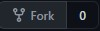

# Readme Generator

This project will generate a markdown file for future project READMEs. It will ask a series of questions like project title, description, how to install it, how to use it, collaborators, what license to use, your github username, your email, and tests.

## Getting Started

These instructions will get you a copy of the project up and running on your local machine for development and testing purposes.

### Prerequisites

Pease have these installed on your machine:
* [Git](https://git-scm.com/downloads)
* [Node.js](https://nodejs.org/en/download/)

You will also need a github account. Get one [here](https://github.com/).

### Installing

1. Fork the project to your account.

    

2. Click the green code button and copy the SSH url. Should look like this:
    ```
    git@github.com:<username>/professional-readme-generator.git
    ```
3. Open Git bash terminal and navigate to your desktop.
    ```
    cd Desktop
    ```
4. Clone the repository to your desktop. You can right click on the terminal to paste the SSH url.
    ```
    git clone git@github.com:<username>/professional-readme-generator.git
    ```
5. Navigate to the repository and into develop folder.
    ```
    cd professional-readme-generator/develop/
    ```
6. Download and install inquirer.
    ```
    npm install
    ```

### Usage

1. Now that all the dependencies are installed, to run the program write in terminal:

        node index.js

2. Answer the prompts. A new markdown file will be created when you see:

        Success! Data written to <title>.md.

3. Open file explorer on the current directory.

        explorer .

4. Your new markdown file will be located here.

    
## Built With

* [Javascript](https://developer.mozilla.org/en-US/docs/Web/JavaScript)
* [Node.js](https://nodejs.org/docs/latest-v15.x/api/)

## Authors

* **Isaac Cortes Hernandez** 

- [Link to Portfolio Site](https://icortes.github.io/my-first-portfolio/)
- [Link to Github](https://github.com/icortes)
- [Link to LinkedIn](https://www.linkedin.com/in/cortes-isaac)

## License

This project is licensed under the MIT License 

## Acknowledgments

* Node.js [documentation](https://nodejs.org/docs/latest-v15.x/api/fs.html#fs_fs_writefile_file_data_options_callback)
